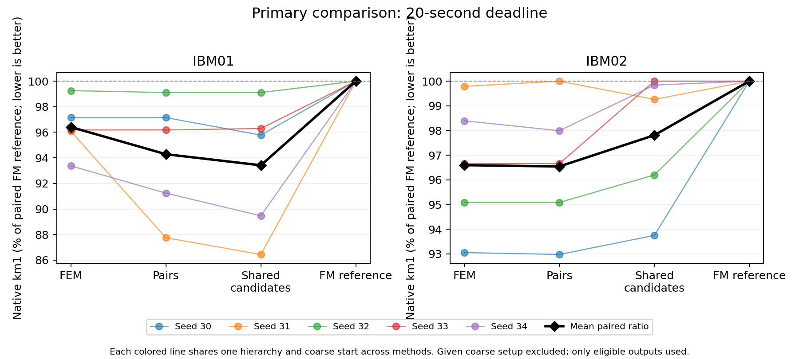
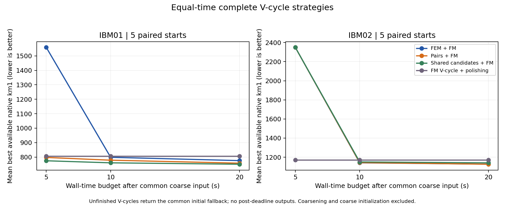

# HIP 原生 IER 的完整 V-cycle 等时间实验

2026-09-24；CPU 单线程；IBM01／IBM02 各 seeds 30–34。预先固定 5／10／20 秒检查点，**20 秒为主比较**。方法见 [运行前协议](../../IER_EQUAL_TIME_PROTOCOL.md)，原始记录见 [summary.json](summary.json)，汇总计算见 [analysis.json](analysis.json)。

## 结论

**当前配置下，FEM 没有建立相对便宜组合搜索的等时间优势。** IBM01 上简单候选选择最好，IBM02 上 FEM 与两两组合非常接近。联合移动及候选刷新有用，但不能把它们的全部收益归于 FEM。

| 20 秒内最佳可用 km1，5 seeds 均值 | FEM＋FM | 两两组合＋FM | 简单候选＋FM | Flow 参考 |
|---|---:|---:|---:|---:|
| IBM01 | 775.6 | 757.8 | **750.6** | 805.6 |
| IBM02 | 1127.2 | **1126.4** | 1140.6 | 1170.2 |

20 秒时四种方法全部完成了至少一个 V-cycle。FEM 对两两组合合计 **1 胜、4 平、5 负**；对简单候选 5 胜、5 负；对 Flow 为 10 胜、0 平、0 负。IBM02 两两组合与 FEM 的均值仅差 0.8（约为两两组合均值的 0.071%），不能据这五个起点宣称普遍优势。



图中每条彩线对应一个相同 hierarchy／粗层起点，以该 seed 的 Flow 结果归一化；黑线是逐 seed 比率的均值，和上表“原生 cut 均值之比”并非同一统计量。

## 1. 比较范围和计时规则

这是**给定共同 hierarchy 与粗层 FEM 标签后的 refinement 时间比较**，不包括生成这些共同输入的粗化和 FEM 初始化成本，因此不能称为完整 HIP 的端到端总延迟。

每个输入／seed 重建一份所有方法共享的 HEM hierarchy，核对最终 coarse mapping 和节点权重与此前保存基线一致，并存档全部中间层。本次没有用历史中间层指纹证明它与旧 hierarchy 每层完全相同。

四个方法如下：

| 方法 | 每层操作 | 剩余时间如何使用 |
|---|---|---|
| FEM | 两轮 IER；每轮 8 trials × 100 steps；之后 FM 两 passes | 从共同粗层标签重新运行完整 V-cycle，刷新随机种子 |
| 两两组合 | 两轮 IER；枚举全部二 atom 子集；之后相同 FM | 相同重启政策 |
| 简单候选 | 两轮 IER；只选 all-off／all-on／每个 single atom；之后相同 FM | 相同重启政策 |
| Flow 参考 | 只有 FM 的 V-cycle | 在自己的原图终态继续 FM，直到整个 assignment 不变或超时 |

所有 IER 使用相同 local 候选生成规则，每轮最多 96 个池内节点、24 个顶点互斥的平衡 atoms；共享 all-off／all-on／single 候选。**简单候选控制包含 all-on，且候选生成随种子变化，不是整个算法完全确定或只允许单点移动。** `flow` 是单点增量贪心／FM 风格算法，不是 max-flow，也不是 KaHyPar。

外层 attempt 的 seed 为 `input_seed + 1000003 * attempt`，区别于 IER 内轮的 104729 步长；所有方法共享对应种子序列。接受不同动作后状态和后续池可以分叉，所以本实验比较完整策略，不隔离纯 selector 求解器的因果作用。

每个方法只运行一次到最大预算，再从同一时间轨迹读取三个检查点：

- warmup 使用独立小例；正式计时禁止并发 CPU 实验。方法顺序按 case 轮换。
- 开始计时后才提升、评分并检查共同初始标签，将它作为 fallback，记录可用时刻。
- 配置、拷贝、层间投影、候选生成、求解、原生评分、容量检查、incumbent 比较以及状态／诊断记录都计时。
- 完成上述工作后才记录 candidate 的 available time；外部重复核验和写盘统一放在整条 arm 结束后。
- 只有截止前**完整返回**的结果可入选。不计部分 V-cycle 的中间进度；最后一次不可分调用可以超时完成，但不得用于已经过去的检查点。
- 无完整输出时，明确记为 `no_result`，best-available 只能来自本方法计时后计算的共同 `initial_only`，不借用其他方法、预热或超时结果。

## 2. 主比较的全部配对结果

以下每行都是同一 coarse 起点和同一 20 秒预算下的 native km1：

| 输入 | seed | FEM | 两两组合 | 简单候选 | Flow |
|---|---:|---:|---:|---:|---:|
| IBM01 | 30 | 783 | 783 | 772 | 806 |
| IBM01 | 31 | 808 | 738 | 727 | 841 |
| IBM01 | 32 | 667 | 666 | 666 | 672 |
| IBM01 | 33 | 831 | 831 | 832 | 864 |
| IBM01 | 34 | 789 | 771 | 756 | 845 |
| IBM02 | 30 | 1206 | 1205 | 1215 | 1296 |
| IBM02 | 31 | 944 | 946 | 939 | 946 |
| IBM02 | 32 | 1451 | 1451 | 1468 | 1526 |
| IBM02 | 33 | 810 | 810 | 838 | 838 |
| IBM02 | 34 | 1225 | 1220 | 1243 | 1245 |

| FEM 的胜／平／负 | 对两两组合 | 对简单候选 | 对 Flow |
|---|---:|---:|---:|
| IBM01 | 0／2／3 | 1／0／4 | 5／0／0 |
| IBM02 | 1／2／2 | 4／0／1 | 5／0／0 |

IBM01 的差异不是每个 seed 都很大：FEM 与两两组合的均值差 17.8，其中 seed 31 的差值为 70，其余为 0、1、0、18。报告全部配对，避免只展示均值隐藏这种差异。

## 3. 时间—质量和截止前完成数

下表为最佳**可用** cut 均值。标 † 的项没有完成 V-cycle，数值是共同初始 fallback，不是优化结果；没有从均值中删除这些运行。

| 输入 | 预算 | FEM | 两两组合 | 简单候选 | Flow |
|---|---:|---:|---:|---:|---:|
| IBM01 | 5 s | 1558.4 † | 797.4 | 774.4 | 805.6 |
| IBM01 | 10 s | 798.4 | 778.4 | 760.2 | 805.6 |
| IBM01 | 20 s | 775.6 | 757.8 | 750.6 | 805.6 |
| IBM02 | 5 s | 2349.2 † | 2349.2 † | 2349.2 † | 1170.2 |
| IBM02 | 10 s | 1141.0 | 1143.0 | 1150.2 | 1170.2 |
| IBM02 | 20 s | 1127.2 | 1126.4 | 1140.6 | 1170.2 |

5 秒时，IBM01 FEM 为 0/5 完整返回，其他方法为 5/5；IBM02 三种 IER 都是 0/5，Flow 为 5/5。10 和 20 秒所有方法均为 5/5。因此短预算结果高度依赖当前“完整 V-cycle 才返回”的接口，不能把 fallback cut 解释成求解器已输出的优化质量。



同一预算下，低成本后端可执行更多完整搜索：

| 输入／预算 | FEM 完整 V-cycles | 两两组合 | 简单候选 | Flow |
|---|---:|---:|---:|---:|
| IBM01／10 s | 5 | 12 | 12 | 5 |
| IBM01／20 s | 15 | 27 | 27 | 5 |
| IBM02／10 s | 5 | 5 | 5 | 5 |
| IBM02／20 s | 10 | 14 | 14 | 5 |

这些数量对每个输入的 5 seeds 求和。Flow 每个 seed 另外完成了一次原图 polishing，assignment 完全不变后停止；它不是把同一结果重复运行以填满预算，也不是随机重启对照。

## 4. 超时结果确实可能更好

共保存 157 次完整执行：截止前 117 个 V-cycles、10 次 Flow continuation，另有 30 个超时 V-cycles。所有执行成功；超时的 30 个均排除，其中 9 个比该方法 20 秒内结果更好。例如：

| 方法／实例 | 20 秒内 cut | 晚到 cut | 累计完成时间 |
|---|---:|---:|---:|
| 简单候选／IBM02 seed 33 | 838 | 829 | 20.006676 s |
| FEM／IBM01 seed 31 | 808 | 803 | 20.519 s |
| 两两组合／IBM02 seed 30 | 1205 | 1159 | 22.445 s |

即使只晚约 6.7 ms，也没有计入 20 秒结果。这个例子也说明单次 wall-time 测量会受运行抖动影响；本轮没有做多次计时重复，不能用很小的均值差宣称显著速度或质量优势。

## 5. 验证与可复现材料

相关集成回归 **171 passed in 1.23s**，覆盖新后端、真实小加权 V-cycle、层间投影、独立重启、计分开销、恰好截止、晚到 fallback、失败保留与排除、Flow 状态固定点和完整产物保存。

本次 driver 内部独立重复评分／容量与投影核验覆盖 157 次执行、1333 个 refinement stages，均成功。32 个源文件／协议／测试哈希、23 个输入哈希在运行前后保持一致；每个 case 子目录保存完整 hierarchy、各方法 JSON 和 NPZ 状态。独立审计结果另见 audit.json（完成后补充精确覆盖数）。

环境：Python 3.12.7、NumPy 1.26.4、Torch 2.9.0，macOS 26.3 arm64，Torch／BLAS／OMP／MKL 均为单线程。正式批次时间为 UTC 11:52:16–12:04:40；这个批次时长还包含共同准备、外部核验、写盘和保留的超时，不是某方法的预算。

从仓库根目录运行，使用新的空输出目录：

```bash
OPENBLAS_NUM_THREADS=1 OMP_NUM_THREADS=1 MKL_NUM_THREADS=1 \
PYTHONDONTWRITEBYTECODE=1 /opt/anaconda3/bin/python \
  benchmarks/hypergraph/compare_ier_equal_time.py \
  --instances ibm01 ibm02 --seeds 30 31 32 33 34 --budgets 5 10 20 \
  --output benchmarks/hypergraph/results/fem-ier-equal-time-new-run

OPENBLAS_NUM_THREADS=1 OMP_NUM_THREADS=1 MKL_NUM_THREADS=1 \
  /opt/anaconda3/bin/python benchmarks/hypergraph/audit_ier_equal_time.py \
  benchmarks/hypergraph/results/fem-ier-equal-time-new-run

OPENBLAS_NUM_THREADS=1 OMP_NUM_THREADS=1 MKL_NUM_THREADS=1 \
MPLCONFIGDIR=/private/tmp/ier-matplotlib /opt/anaconda3/bin/python \
  benchmarks/hypergraph/summarize_ier_equal_time.py \
  benchmarks/hypergraph/results/fem-ier-equal-time-new-run
```

驱动支持 `--baseline` 和 `--ibm-directory`。本次基线为 `fem-multiseed-20260924-v2`，原始数据位于 `/private/tmp/ising-hgr.K5jm2Y`；临时目录不保证长期保留，替换位置须保持输入哈希一致。图同时保存 PNG 与 PDF，绘图脚本自身及 summary 哈希记录在 analysis.json。

## 6. 对下一步的影响

应把简单候选和两两组合保留为强基线；IBM01 的下一步重点是有效候选／搜索覆盖与预算利用，IBM02 则值得在当前接近的两两组合与 FEM 之间做重复计时及更多起点比较。不能由本轮断言 FEM 在其他 trials／steps、GPU、不同 pool 或更复杂协同子问题中必然没有价值。

本轮只包含两个固定真实输入，各五个粗层起点；检查点共享同一次运行，不是独立重复。没有比较 KaHyPar，没有认证原图最优，也没有测量 IBM 的近优 overlap。结果不能证明 SOTA、OGP 失败机制或 OGP 突破。
