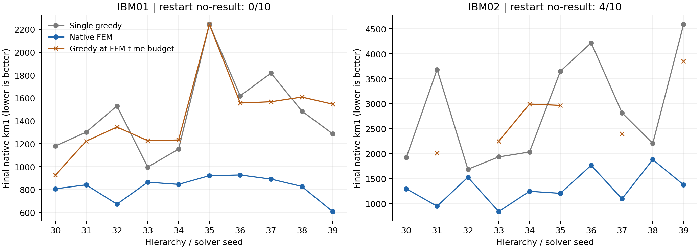

# 原生超图目标：多种子验证与搜索可达性

日期：2026-09-24。承接 [FEM 修复报告](../fem-repair-20260924/REPORT.md)。本轮使用当前工作树的生产 FEM／flow 路径，并新增独立的原生 Metropolis 搜索基准。生产求解器默认行为未在本轮改变。

本轮区分三个对象：修复后在真实数据上的收益是否稳定；容量约束下允许的移动能到达哪些解；可达路径是否需要暂时增加目标值。后两者不能仅由 overlap 直方图判断。

## 1. IBM 多种子与时间预算对照

**20/20 个配对种子上，FEM 最终 km1 低于单次 greedy；所有输出均满足容量约束。** 汇总由 [analysis.json](analysis.json) 重算，原始每次运行保存在 [多种子结果](../fem-multiseed-20260924-v2/summary.json)。

| 输入 | seeds | Greedy 平均最终 km1 | FEM 平均最终 km1 | 均值降低 | FEM 胜／平／负 | Greedy / FEM 中位下游耗时 |
|---|---:|---:|---:|---:|---:|---:|
| IBM01 | 10 | 1461.2 | 820.1 | 43.9% | 10 / 0 / 0 | 1.793 / 2.485 s |
| IBM02 | 10 | 2874.2 | 1317.0 | 54.2% | 10 / 0 / 0 | 4.772 / 4.745 s |

Greedy−FEM 的平均配对 cut 差及 seed-bootstrap 95% 区间：IBM01 为 641.1 `[444.8,849.6]`；IBM02 为 1557.2 `[919.7,2209.6]`。没有粗化失败、FEM 失败或 single-greedy 失败。IBM01 的 FEM 耗时更长，不能把目标改善同时宣称为速度提升。

时间预算对照另列如下；两列均值仅使用双方都有按时输出的相同 seeds：

| 输入 | 有效配对 | Greedy 预算内最佳平均 km1 | 相同配对的 FEM 平均 km1 | FEM 胜／平／负 | Greedy 无按时输出 |
|---|---:|---:|---:|---:|---:|
| IBM01 | 10 | 1447.4 | 820.1 | 10 / 0 / 0 | 0/10 |
| IBM02 | 6 | 2745.2 | 1117.0 | 6 / 0 / 0 | 4/10 |

本次预算内每个成功的 restart 组仅完成 **1 次**完整 greedy 流程；因此它检验的是较短 FEM 延迟下的基线可用性，尚不能回答更长预算的多重启表现。IBM02 seeds 30、32、36、38 的首条重启分别晚约 0.399、0.258、0.078、0.295 秒，均作为 `no_result`，不混入配对均值。接近 deadline 的计数会受机器负载与计时噪声影响。

独立审计还确认，8 个比预算内 winner 更好的超时结果均被排除。例如 IBM01 seed 30：FEM 在 2.680 秒返回 cut 806；greedy 第一条在 2.197 秒返回 926，第二条累计 4.085 秒才返回 **715**。所以“FEM 胜出”必须限定于本轮完整流程与时间预算，不能写成更多搜索时间下仍总是胜出。



图的横轴是种子索引，连线仅辅助对应同一 seed；缺失的橙色结果不插值。可导出的矢量版见 [multiseed-cuts.pdf](multiseed-cuts.pdf)。

每个 IBM 输入使用 seeds 30–39。每个 seed 仅粗化一次，FEM 与 greedy 使用同一 HEM hierarchy：q=4、目标粗化到 200 个节点、各块容量不超过平均值的 1.03 倍。FEM 为 8 trials × 150 steps；两种方法使用相同 flow refinement，每次调用 2 passes。

先用独立小实例预热两个完整路径，排除首次 import／optimizer 初始化成本。FEM 与单次 greedy 的执行顺序交替。随后给予一组独立 greedy 重启相当于该次 FEM 初始化＋V-cycle 的实测时间预算：只允许截止时间前完成的可行解成为输出；超时完成者仍保存，但不能计入最佳值。若没有按时完成的解，明确记作 `no_result`，不借用已运行的 single-greedy。

共享粗化时间单列。外部 cut／loads 核验和文件写入统一放在计时之外。预算依赖本次 FEM 的实测时长，属于“在 FEM 返回时刻，greedy 重启能给出什么”的比较，并非预先固定秒数的通用 deadline benchmark。重启流程可能有一次超时运行，其耗时和结果被保留。

均值、胜负和 bootstrap 均按同一输入的 seed 配对计算；缺失输出单列。95% bootstrap 区间来自 20,000 次 seed 重采样，描述这两个固定输入的运行随机性，不能当作跨数据集置信区间。两个 IBM 输入不代表一般超图或稿件的完整 benchmark 集，也没有与 KaHyPar 比较。

## 2. 加权容量可以让局部链永远到不了更好的解

复用前轮四个加权原图及 FEM 最终划分作为固定起点，节点权重为 1／2、严格容量 epsilon=0。枚举所有有标签的可行划分，求出原始全局最优，以及保留起点“每块各种节点权重数量”的最优值。

在这些条件下，每块负载恰好等于容量。改变划分的跨块单点移动必超载；跨块不等权的两点交换也必超载。因此，由单点移动和 pair swap 构成的可行链保持每块 weight-1／weight-2 的节点数量。等权交换恰好连通具有相同数量表的所有划分。**如果全局最优不在这个集合，增加温度或运行时间也不能使这条链到达它。** 这个不变量依赖严格容量和当前正整数权重，不能直接外推到 IBM 的 3% slack。

| 实例 | FEM 起点 km1 | 全局最优 | 局部可达集合最优 | 可达状态／全部可行状态 |
|---|---:|---:|---:|---:|
| weighted n=8, q=2 | 21 | 17.5 | 18 | 36 / 44 |
| weighted n=8, q=3 | 37 | 37 | 37 | 72 / 234 |
| weighted n=12, q=2 | 25.5 | 22 | 25.5 | 400 / 580 |
| weighted n=12, q=3 | 48.5 | 44.5 | 44.5 | 8100 / 13560 |

在相同起点、每方法 10 个 seeds、每次 3000 次提案下比较：

- **zero-local**：仅 pair swap，零温，接受降代价和等代价移动。
- **anneal-local**：仅 pair swap，beta 从 0.05 指数升至 8，允许按 Metropolis 概率上坡。
- **anneal-block**：75% pair swap＋25% 块提案，退火相同。块大小从 2／3／4／6 均匀选择，均匀抽取节点子集和两个标签，在子集中交换这两个标签；非法容量直接拒绝。

三点提案可以把两个 weight-1 节点与一个 weight-2 节点联合交换，从而改变局部链保留的数量表。提案不依赖当前可行候选的重采样，保持对称性。

| 实例 | zero-local 最优命中 | anneal-local 最优命中 | anneal-block 最优命中 | 两种退火的平均 best gap（local / block） |
|---|---:|---:|---:|---:|
| n=8, q=2 | 0/10 | 0/10 | 10/10 | 0.5 / 0 |
| n=8, q=3 | 10/10 | 10/10 | 10/10 | 0 / 0 |
| n=12, q=2 | 0/10 | 0/10 | 10/10 | 3.5 / 0 |
| n=12, q=3 | 2/10 | 10/10 | 8/10 | 0 / 0.45 |

n=8、q=3 的起点已经全局最优，其 best-so-far 命中率是定义使然，不能作为发现最优的能力。n=12、q=3 上块方法少命中两次，本批次没有呈现一致收益；10 个 seeds 不足以断言其真实成功概率较低。上述比较控制提案次数，不是等时间；局部退火每次中位耗时约 0.05–0.06 秒，块方法约 0.06–0.07 秒，原始耗时和拒绝率均有保存。

## 3. 有限 overlap 缺口与有限交换能垒

此前完整枚举筛出的三个二分实例，各有两个最优解类，含自配对的最优 overlap 支持为 `{0,1}`。本轮在完整可行 pair-swap 图上求 minimax 路径，消除合法的全局标签翻转对称性。

| 实例 | 原生最优 | 两最优类间最小路径峰值 | 能垒高度 | zero-local 访问另一类 | anneal-local | anneal-block |
|---|---:|---:|---:|---:|---:|---:|
| random-n08-i003 | 14 | 15 | 1 | 0/10 | 10/10 | 10/10 |
| random-n08-i009 | 14 | 15 | 1 | 0/10 | 10/10 | 10/10 |
| random-n12-i008 | 19 | 20 | 1 | 0/10 | 10/10 | 10/10 |

每次都从第一个已知最优类出发，仍使用 3000 次提案。这里评价的是访问另一个最优类，不能用始终为零的 best gap 评价寻优。零温允许 plateau 移动，但不能跨越高度 1 的能垒；局部退火在这些运行中均访问了另一个最优类。

能垒 1 只针对 pair-swap 邻接；块提案的邻接不同，不一定经过同样的中间状态。三个小例是此前有意筛出的有限 gap 个案，不是实例分布的随机样本。这些结果既不是混合时间估计，也不是渐近 OGP 下界的突破。

## 4. 正确性与产物

[native_mcmc.py](../../native_mcmc.py) 按 incident-edge label counts 计算原生 weighted km1 的增量，联合移动中每条超边只计一次。固定有限 beta 下，对称提案＋Metropolis 接受＋非法 self-loop 满足详细平衡；这并未保证不可约或已经混合。退火轨迹及 best-so-far 是优化记录，不是经过认证的 Gibbs 样本。

[native_search_probe.py](../../native_search_probe.py) 对 **210 条轨迹、每条 3001 个状态，共 630,210 条状态记录**逐项核对完整枚举 oracle，验证中间状态的容量与原生能量。每步 state code 和能量保存在压缩 NPZ 中，可恢复完整划分；未仅保留 winner。机制结果见 [summary.json](../native-search-20260924/summary.json)。

**新增 29 项测试通过**，涵盖原生联合增量的完整小例枚举、共享超边、三点等总重交换、固定 beta 转移矩阵详细平衡、非法 self-loop、可达集合 oracle、时间预算边界、超时结果排除和 Torch 粗节点权重验证。测试输出见 [verification.json](verification.json)；前轮 93 项修复测试另有记录。本轮主仓库及子模块 `git diff --check` 均通过。运行的输入／源码哈希与环境分别保存在两个实验目录中。

IBM [独立审计记录](../fem-multiseed-20260924-v2/audit.json) 从原始 hgr 与 NPZ 重算全部 **76 个最终划分**（40 个 single＋36 个 restart attempts）的 cut 和 loads，均通过。重启中 16 个按时完成、20 个超时完成，执行失败和可行性验证失败均为零；没有把超时当作求解失败，也没有让超时结果参与预算内选优。

首次 IBM 启动被预热验证拦截：基准核验函数直接将 Torch 权重传入 NumPy 容量函数，触发类型错误。修正核验输入转换并补测后，使用 `-v2` 新目录重跑；原 [失败预热 manifest](../fem-multiseed-20260924/manifest.json) 保留。该次没有运行任何正式 IBM 样本，没有按结果筛除失败 seed。

## 5. 对 HIP／OGP 研究的含义

1. 先用原生目标和可靠容量语义做性能比较，继续追溯稿件历史版本。当前工作树的改进不能自动解释历史实验原因。
2. 对加权粗层 refinement，应明确允许哪些等总重联合移动。局部链的可达性不足可以在完全不讨论 OGP 的情况下导致持久次优。
3. 当好解可达但需要上坡时，退火可能有用；本轮 q=3 小例及 finite-gap 个案支持这一机制，但不能保证其他规模和实例有效。
4. 更丰富的分布或 Neural Operator proposal 可以用于提出等总重节点组，并由原生目标验收。首先应比较这一简单的块提案基线，不能仅凭模型“全局作用”就推断跨越了 OGP。
5. 本轮尚未把块搜索集成到生产 V-cycle，也未证明块核在任意加权可行域中不可约。适合继续检验的是：在真实粗层相同起点与预算下，等总重联合提案是否带来稳定收益。

## 复现

在仓库根目录使用 `/opt/anaconda3/bin/python`；以下输出目录必须尚未保存同名结果：

```bash
OPENBLAS_NUM_THREADS=1 OMP_NUM_THREADS=1 MKL_NUM_THREADS=1 /opt/anaconda3/bin/python benchmarks/hypergraph/native_search_probe.py --output benchmarks/hypergraph/results/native-search-rerun --seeds 0 1 2 3 4 5 6 7 8 9 --steps 3000
OPENBLAS_NUM_THREADS=1 OMP_NUM_THREADS=1 MKL_NUM_THREADS=1 /opt/anaconda3/bin/python benchmarks/hypergraph/compare_fem_multiseed.py --seeds 30 31 32 33 34 35 36 37 38 39 --ibm-directory /private/tmp/ising-hgr.K5jm2Y --output benchmarks/hypergraph/results/fem-multiseed-rerun
/opt/anaconda3/bin/python benchmarks/hypergraph/analyze_search_followup.py
```

最后一条默认分析本轮保存的正式结果；分析复现批次时，另传 `--multiseed`、`--search`、`--output`。IBM 原始文件位于临时目录，清理后需按前轮报告的固定版本来源重新准备并核验哈希。代码仍含主仓库和 `lib/qubo-solver` 的未提交修改，仅检出旧 Git HEAD 不足以复现。
